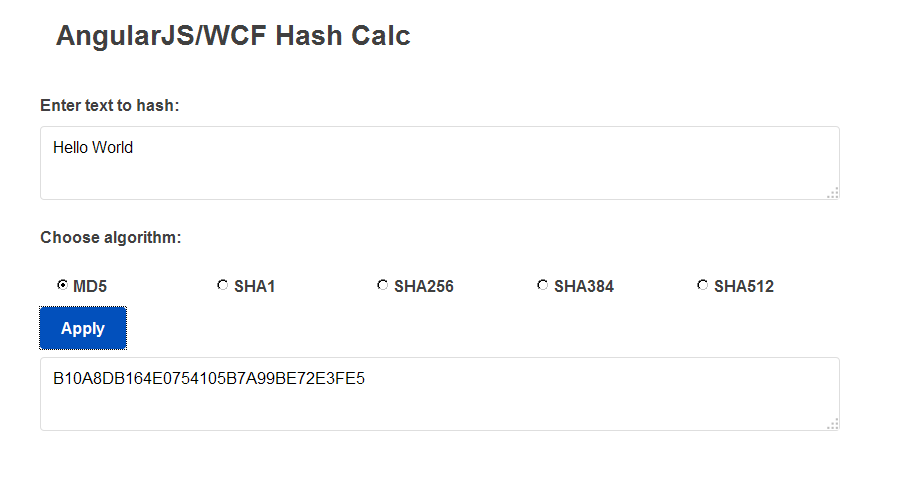
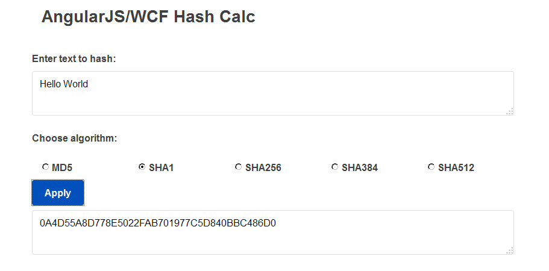
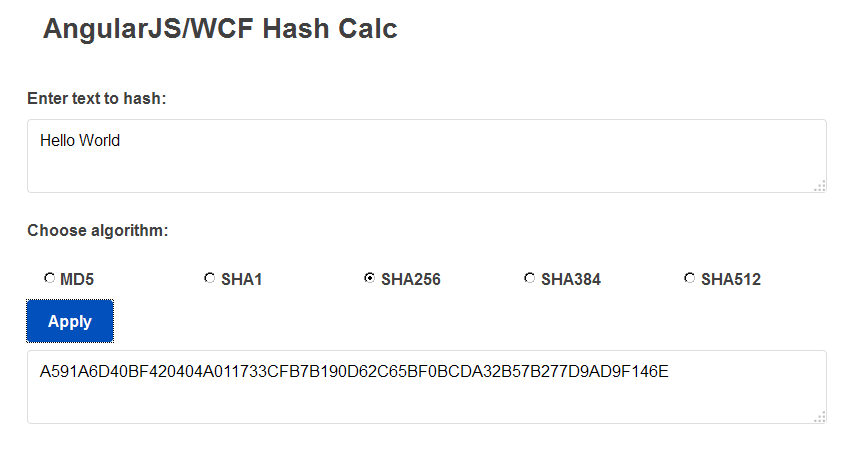
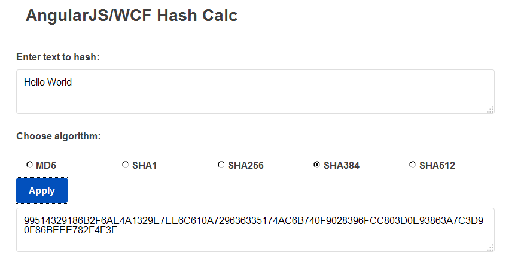
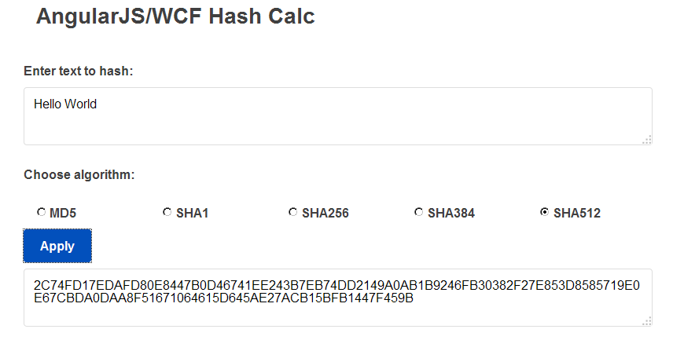
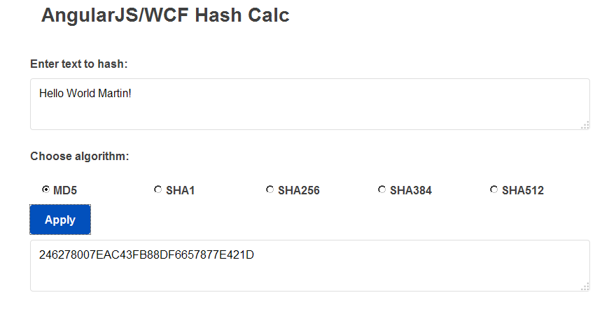

# Understanding principles of security: Integrity

<h3>The principles of Security</h3>

The foundational principles of security are: <strong>confidentiality</strong>, <strong>integrity</strong> and <strong>availability</strong>. These principles known as the CIA triad is a guideline for information security for an organization.

<h3>Integrity</h3>

Integrity is accuracy, consistency, and trustworthiness of the data during its entire life cycle. Another term for integrity is quality. Data must be unaltered during transit and not changed by unauthorized entities. Methods used to ensure data integrity include hashing, data validation checks, data consistency checks, and access controls.

<h3>Hashes and Checksum</h3>

The process of <strong>hashing</strong> involves passing data through a cryptographic function, called a hash or digest function. This process yields a small - relative to the size of the original data- value that uniquely identifies the data. Depending on the algorithm used, the value's size is usually 128 or 160 bits. Checksum hashing can be used to verify integrity of the data during transfer.
<strong>Hashing</strong> is a one-way function that creates a fixed-length output (known as the hash, hashing value, fingerprint, message digest, and so on) from an input of any length. Common hash functions include MD5, SHA-1, SHA-256, and SHA-512. These hash functions use complex mathematical algorithms.

For example, Message Digest 5 (MD5) is a 128-bit hash algorithm. This means that no matter what the size of the input data, the output hash will always be 128 bits long. Hashing is not an encryption algorithm. Instead, hashing is used to produce a unique identifier of data without modifying the original data. The data could be a file, a hard drive, a network-traffic packet, or an email message.
The hashed value is used to detect when changes have been made to a resource. For example, when a hard drive is being imaged to create an exact duplicate, a hash is produced of the original drive before the duplication process.

<strong>Fig 1. Summary of hashing algorithms</strong>

A hash tells you nothing about the data, but it uniquely identifies it. The hashed value is simply there for comparison.

<strong>Fig 2. The hash function operates on fixed-size blocks of data</strong>

Writing a simple Hash Calculator with AngularJS, HTML5, C# and WCF.
I've written an app to demonstrate how to implement hash functions in a REST Service. The app communicates with a WCF REST service that uses the C# abstract class System.Security.Cryptography.HashAlgorithm to achieve encryption.

The user enters the text to encrypt, selects the algorithm to use.
The user submits the information to the service in order to get the hash code.
The hash web service presents the hash code to the user.
Testing with different algorithms, we can see the length of the output.

<strong>Fig 3. Using the MD5 algorithm.</strong>

<strong>Fig 4. Using the SHA1 algorithm.</strong>

<strong>Fig 5. Using the SHA256 algorithm.</strong>

<strong>Fig 6. Using the SHA384 algorithm.</strong>

<strong>Fig 7. Using the SHA512 algorithm.</strong>

<strong>Fig 8. Changing the text, we can see a totally different output, but without no changes in the length.</strong>

<h3>Conclusion</h3>

Keeep in mind that hash functions do not encrypt the data. They use the data to make a fingerprint or snapshot of the data that is given to you as a code. That code is used to determine whether or not the data has been altered. If the data you receive has been altered, you will not get the same code number as the original data.

